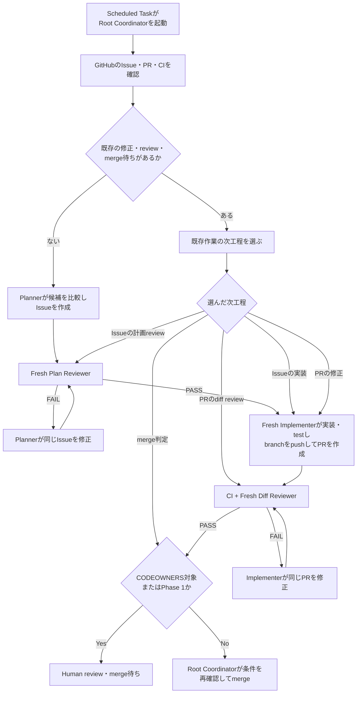

# Autonomous development workflow proposal

Status: Draft for review

Tracking issue: [#37](https://github.com/Bite-8/AI/issues/37)

## 1. この文書で決めること

この文書は、Humanを通常のIssue承認、実装確認、PR review、mergeから外し、Agentが`GOAL.md`へ向かう開発を継続するための初期案である。最終的に通常開発のHuman待ちをなくすことを目的とし、Phase 1のHuman reviewは移行中の検証に限定する。

今回決める成果物は次の2つに限定する。

1. IssueとPRを使った開発workflow
2. そのworkflowをpromptから定期実行する具体的な方法

この提案の範囲は、設計だけでなく必要なrepository fileの実装とScheduled Taskの作成までを含む。このPRの差分はそのための草案であり、合意後に6章の実装PRを順にmergeしてからScheduled Taskを作成する。Human gateの解除、GitHub ruleset変更、自動mergeは、Phase 1の結果を確認するまで行わない。

## 2. 提案の要点

- 計画はIssue、実装と検証結果はPR、機械検証はCIをsource of truthにする
- Root Agentは実装を行わず、GitHubの状態確認とsubagentの起動を担当するCoordinatorにする
- Issue作成、実装、Plan review、Diff reviewを、それぞれfresh contextのsubagentへ分離する
- 定期実行promptは短い入口にし、繰り返す手順とreview基準はSkillへ置く
- 1回の定期実行は1工程で終了せず、外部待ちまたはHuman判断に到達するまで進める
- 初期実装では独自Task JSON、portfolio、policy file、Controllerを作らない
- Phase 1では全PRをHumanがmergeし、実運用を確認してから通常PRの自動mergeを検討する

## 3. 開発workflow

### 3.1 役割

| 役割 | 責務 | Repository / GitHub write |
|---|---|---|
| Root Coordinator | 現在状態の確認、次工程の選択、subagent起動、停止条件とmerge条件の確認 | 原則行わない。review結果の転記と、許可後のmergeだけ |
| Planner | `GOAL.md`と現在状態から候補を比較し、次のIssueを1件作る | Issue作成・修正 |
| Plan Reviewer | Issueが次の作業として妥当か、scopeと完了条件が検証可能か確認する | なし |
| Implementer | Plan review済みIssueを実装し、testしてPRを作る。指摘があれば同じPRを修正する | branch、commit、push、PR作成・更新 |
| Diff Reviewer | Issueに対して最新PR差分が正しいか、回帰やtest不足がないか確認する | なし |
| CI | test、compile、設定、再現性、diffを決定論的に検査する | Check結果のみ |
| Human owner | Goal、GitHub・AI設定、費用、外部system、例外判断を確認する | Approve、設定変更、Phase 1のmerge |

同じ時点でwriteを行うsubagentは1つだけにする。複数のImplementerに同じbranchやworktreeを編集させない。

### 3.2 Contextの分離

Planner、Implementer、Plan Reviewer、Diff Reviewerは、工程ごとに新しいsubagentとして起動する。

特にReviewerは次を必須とする。

- 親Agentの会話履歴を継承しないfresh contextで起動する
- Rootから作成者の結論、要約、推奨案を渡さない
- 入力はIssue番号またはPR番号、review種別、使用するSkillだけにする
- `GOAL.md`、Issue、PR、diff、test結果を自分で読み直す
- Plan ReviewerとDiff Reviewerにも別contextを使う
- `.codex/agents/plan-reviewer.toml`または`.codex/agents/diff-reviewer.toml`で`sandbox_mode = "read-only"`を指定し、Repositoryの変更を実行環境側で禁止する
- GitHubへwriteせず、`PASS`または`FAIL`とblocking findingを返す

Root CoordinatorはReviewerの結果を要約・改変せず、そのままIssueまたはPRへ転記する。

`read-only` sandboxはlocal fileの変更を防ぐが、共有GitHub credentialのremote writeまで分離するものではない。Phase 1ではReviewerのGitHub write禁止はAgent instructionであり、security boundaryとして扱わない。Remote writeも外側から禁止する必要が生じた場合は、Reviewerへread-only GitHub credentialまたはread-only toolだけを渡す構成を別Issueで設計する。

### 3.3 通常Taskの流れ



IssueとPRが実行間の引き継ぎになる。専用memory fileは作らず、途中でrunが終了しても次回はGitHubの状態から再開する。

### 3.4 1回の定期実行で進める範囲

1回のrunは「1工程だけ」ではなく、次の停止条件に当たるまで同じTaskを進める。

- CIや外部処理の完了待ちになった
- CODEOWNERS対象またはPhase 1のPRがHuman review待ちになった
- Reviewerのblocking findingを同じrunで1回修正しても解消できなかった
- 費用、Goal、評価基準、外部systemなどHuman判断が必要になった
- 認証、競合、dirty worktreeなど、安全に自動復旧できない状態になった
- Scheduled Taskの実行時間内に次工程を安全に完了できない

停止時はIssueまたはPRへ、現在状態、確認済み事項、次に行う工程を残す。次回runは新しいRoot contextでそこから再開する。

### 3.5 作業の優先順位

Root Coordinatorは毎回、全open Issue / PRを確認し、上から最初に該当するTaskを1件選ぶ。

1. Human feedback、failed CI、Review `FAIL`がある既存PRを修正する
2. review待ちの既存PRをDiff reviewする
3. merge条件を満たした既存PRをmergeするか、Human待ちとして止める
4. Plan review済みIssueを実装する
5. Plan review前のIssueをreviewする
6. blocked Issueの解除条件を確認する
7. 上記がなければPlannerがIssueを1件作る

IssueやPRへ独自の状態fieldやlabelは追加しない。毎回、Issue本文とcomment、対応PR、review、checkの実状態から次工程を決める。新しいIssueやPRを作る前に、同じ目的の既存作業がないことを確認する。

### 3.6 Issueとreview結果

Plannerが作るIssueには次を含める。

- 背景と確認した現在状態
- `GOAL.md`のどの差分を縮めるか
- 比較した候補と、この作業を先にする理由
- 目的
- Scope / out of scope
- 完了条件
- 検証方法
- 既知のriskと未解決事項

Plan Reviewerは通常のIssue commentとして次を残す。

```text
Plan review: PASS | FAIL

Blocking findings:
- なし、または修正が必要な事項

確認した根拠:
- GOAL、関連実装、既存Issue/PRなど
```

Issueの目的、scope、完了条件が変更された場合はPlan reviewをやり直す。初期実装ではIssue本文のdigestや専用markerを導入しない。

### 3.7 PRとDiff review

Implementerが作るPRには次を含める。

- `Closes #<Issue番号>`
- Goalとの関係
- 変更内容
- 実行した検証と結果
- 未検証事項と既知のrisk
- CODEOWNERS対象pathの有無

Diff Reviewerは通常のPR commentとして次を残す。

```text
Diff review: PASS | FAIL
Reviewed head: <commit SHA>

Blocking findings:
- なし、または修正が必要な事項

確認した検証:
- diff、test、関連実装など
```

Head SHAが変わったら以前のDiff reviewは無効とし、fresh subagentでreviewし直す。

### 3.8 Merge条件

Phase 1では、すべてのPRをHumanがreviewしてmergeする。

Phase 2でCODEOWNERS対象外の通常PRをAgent mergeへ移す場合は、Root Coordinatorが直前に次を再確認する。

- 関連IssueのPlan reviewが`PASS`
- 最新head SHAのDiff reviewが`PASS`
- Required checksがすべて成功
- PRがdraftではなくconflictがない
- 未解決のHuman comment、Changes requested、blocking threadがない
- IssueのscopeとPR差分が一致する
- CODEOWNERS対象pathを含まない

`GOAL.md`、`.github/`、`.agents/`、`.claude/`、`.codex/`、`AGENTS.md`、`CLAUDE.md`を変更するPRは、引き続き`@bara8383`のreviewとmergeを必要とする。

## 4. Prompt、Skills、repository instructions

### 4.1 配置するfile

初期実装では次のfileを置く。

| Path | 内容 |
|---|---|
| `.agents/skills/development-loop/SKILL.md` | Root Coordinatorの状態確認、優先順位、subagent起動、停止・再開手順 |
| `.agents/skills/review-plan/SKILL.md` | Plan Reviewerの入力、確認観点、`PASS` / `FAIL`の出力形式 |
| `.agents/skills/review-pr/SKILL.md` | Diff Reviewerの入力、確認観点、head SHAを含む出力形式 |
| `.codex/agents/plan-reviewer.toml` | Plan Reviewerの役割と`read-only` sandbox設定 |
| `.codex/agents/diff-reviewer.toml` | Diff Reviewerの役割と`read-only` sandbox設定 |
| `.codex/prompts/development-loop.md` | Scheduled Taskへ設定する短い起動promptのrepository上の原本 |
| `AGENTS.md` | 全Agentが常に守る不変条件とrepository固有のtest command |
| `CLAUDE.md` | `AGENTS.md`を読むよう案内するClaude Code用の薄い入口 |
| `.github/ISSUE_TEMPLATE/autonomous-development.yml` | 3.6の項目を持つIssue form |
| `.github/pull_request_template.md` | 3.7の項目を持つPR template |
| `.github/workflows/ci.yml` | Unit test、compile、`check-config`、mock比較、diff check |

`.agents/`もAI設定としてcode owner reviewの対象にするため、`.github/CODEOWNERS`へ次を追加する。

```text
/.agents/ @bara8383
```

Reviewerは判断手順をSkill、権限と役割をcustom agent設定へ分ける。Skillだけではread-onlyを強制できないためである。初期実装ではPlannerとImplementer専用Skillやcustom agent設定は作らない。Issue template、PR template、`AGENTS.md`だけでは繰り返し品質が安定しないと分かってから追加する。

### 4.2 Scheduled Taskへ設定するprompt

`.codex/prompts/development-loop.md`には次を置く。

```text
`$development-loop` Skillを使用し、このrepositoryの自律開発workflowを進めてください。

GitHubのIssue、PR、review、CIをsource of truthとして、既存作業を優先してください。
RootはCoordinatorに徹し、計画、実装、Plan review、Diff reviewはSkillに定義されたfresh subagentへ委譲してください。
外部待ち、Human判断、安全に復旧できないblockerに到達するまで進め、終了時にGitHub上の状態と次工程を報告してください。
```

詳細な優先順位やreview checklistをこのpromptへ複製しない。変更する場合はSkillを変更し、code owner reviewを通す。

### 4.3 `AGENTS.md`に置く内容

`AGENTS.md`には、定期実行以外の作業にも適用する次の不変条件だけを置く。

- `GOAL.md`を変える作業と、Goalへ近づく通常作業を区別する
- GitHub・AI設定はcode owner review必須とする
- Issue、PR、CIをsource of truthにする
- 有料resource、secret、外部公開、破壊的操作を自律実行しない
- 同時にwriteするAgentを1つに限定する
- Repository固有のtest command

工程の優先順位、subagentへの依頼文、review checklistはSkillへ置く。

### 4.4 初期実装で追加しないもの

- `automation/tasks/*.json`: Issueと重複する
- `automation/portfolio.json`: IssueとPRの一覧と重複する
- `automation/policy.json`: 安全性を自己申告のfileで担保する案は却下する。CODEOWNERSとruleset、CI、sandboxなどAgentの外側から強制し、作業手順だけを`AGENTS.md`に置く
- `automation/l4/`: 実運用で機械化が必要な判定が確認されていない
- 独自Controller: 別credentialと限定APIがなければ実効的な権限境界にならない
- Review結果のdigest、専用schema、専用GitHub Check: Phase 1には不要

## 5. 定期実行を行う具体案

### 5.1 初期実行環境

初期実装はCodex / ChatGPT desktopのScheduled Taskを使用する。CLIにschedulerを実装したり、`cron`から`codex exec`を呼んだりしない。

Scheduled Taskは次の設定にする。

| 項目 | 設定案 |
|---|---|
| Name | `AI autonomous development` |
| Project | このrepositoryのlocal clone |
| Task type | Standalone scheduled task。runごとに新しいchatを開始 |
| Workspace | Git repository用の専用background worktree |
| Schedule | 1時間ごと。初期値は`RRULE:FREQ=HOURLY;INTERVAL=1` |
| Prompt | `.codex/prompts/development-loop.md`の内容 |
| Skill | `$development-loop`を明示的に指定 |
| Sandbox | workspace write。外部書き込み先は対象GitHub repositoryだけ |
| Network | `github.com`とGitHub APIへの接続を許可 |
| Credential | 現在のGitHub App短命credentialを使用 |

Standalone taskを使う理由は、runごとにRootの会話contextをリセットし、状態をGitHubから復元するためである。Dedicated worktreeを使う理由は、Humanのlocal作業や別runの未完了差分と混在させないためである。

### 5.2 作成手順

実装fileをmergeした後、HumanがCodexまたはChatGPT desktopでこのrepositoryを開き、通常chatから次のように依頼する。

```text
このprojectにstandalone scheduled taskを作成してください。

名前: AI autonomous development
実行間隔: 1時間ごと
実行場所: Git repository用の専用background worktree
各run: 新しいchatとして開始
prompt: .codex/prompts/development-loop.mdの内容をそのまま使用
```

作成前に通常chatで同じpromptを手動実行し、IssueやPRを作らないdry runで次を確認する。

- `$development-loop`が読み込まれる
- `GOAL.md`、`AGENTS.md`、open Issue / PRを確認できる
- GitHub App credentialで`gh`と`git fetch`が動く
- fresh subagentを起動できる
- Human判断が必要な操作を実行せず報告できる

確認後にScheduled Taskを有効化し、最初の3 runは毎回結果を確認する。重複Issue、誤ったbranch、context継承、過剰な変更があればtaskをpauseし、Skillを修正してから再開する。

### 5.3 Run開始時の実操作

各runでRoot Coordinatorは、Skillに従って最低限次を行う。

```sh
git status --short
git fetch origin
gh issue list --state open
gh pr list --state open
```

対象IssueまたはPRを決めた後、詳細、全comment、review、最新head、CIを取得する。GitHub状態から再開できないlocal-onlyの変更は残さない。

### 5.4 Claudeで実行する場合

Phase 1は実行runtimeをCodexに固定し、同じTaskをCodexとClaudeから同時実行しない。

Codexでworkflowを3件通した後、Claudeを実行runtimeにする場合は次を別PRで行う。

- `.claude/skills/`へ同じ3つのSkillをClaude用に配置する
- `CLAUDE.md`を、`AGENTS.md`と`development-loop` Skillを読む薄い入口にする
- Claude側の定期実行機能へ、4.2と同じ意味のpromptを設定する
- CodexのScheduled TaskをpauseしてからClaude側を有効化する

GitHubをsource of truthにするためruntimeを切り替えても専用state移行は不要だが、Skillの二重管理方法はClaude導入PRで決める。

## 6. 導入手順

方針承認後、次の順で実装する。

### PR-1: GitHub上の入出力とCI

- `.github/ISSUE_TEMPLATE/autonomous-development.yml`
- `.github/pull_request_template.md`
- `.github/workflows/ci.yml`

Merge後、HumanがCI jobをrequired status checkへ設定する。

### PR-2: Agent rolesとSkills

- `.github/CODEOWNERS`へ`/.agents/`を追加
- `.agents/skills/development-loop/SKILL.md`
- `.agents/skills/review-plan/SKILL.md`
- `.agents/skills/review-pr/SKILL.md`
- `.codex/agents/plan-reviewer.toml`
- `.codex/agents/diff-reviewer.toml`
- `AGENTS.md`
- `CLAUDE.md`

### PR-3: Scheduled Task prompt

- `.codex/prompts/development-loop.md`
- `docs/memo/prompt.md`を新しいpromptへの案内に変更

PR-3 merge後、5.2の手順でScheduled Taskを作成する。

## 7. Phase 1の確認と次の判断

Phase 1では通常Taskを3件、Issue作成、Plan review、実装、Diff review、CI、Human mergeまで通す。

確認するのは次の5点である。

- ReviewerへPlannerまたはImplementerのcontextが渡っていない
- IssueだけでImplementerがscopeどおり実装できる
- 同じIssue、branch、PRを重複作成しない
- Scheduled Taskが途中状態から再開できる
- Agentのmerge判定とHumanの判断が一致する

3件の結果を確認した後、次を別Issueで判断する。

- CODEOWNERS対象外の通常PRをAgent mergeへ移すか
- PlannerまたはImplementerの専用Skillが必要か
- Claudeでも同じworkflowを実行するか
- review結果をrequired checkへする必要があるか
- 繰り返し誤る判定だけをscriptやCIへ移すか

## 8. 参考資料

- [OpenAI: Scheduled tasks](https://developers.openai.com/codex/app/automations)
- [OpenAI: Subagents](https://learn.chatgpt.com/docs/agent-configuration/subagents)
- [OpenAI: Skills](https://developers.openai.com/codex/skills)
